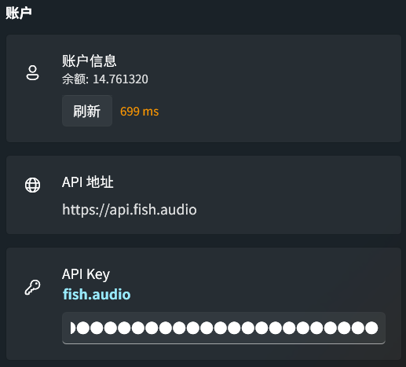
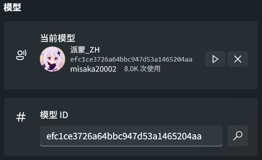
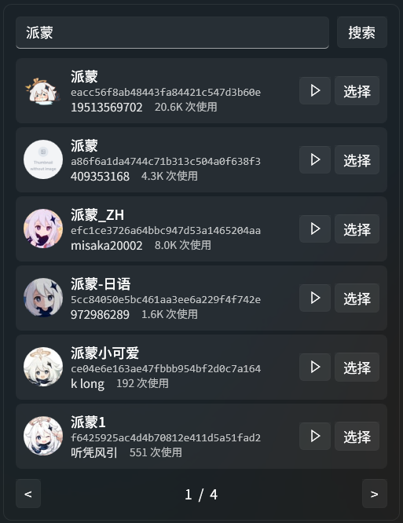
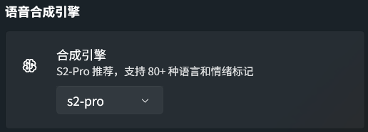
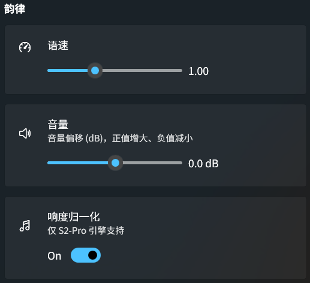
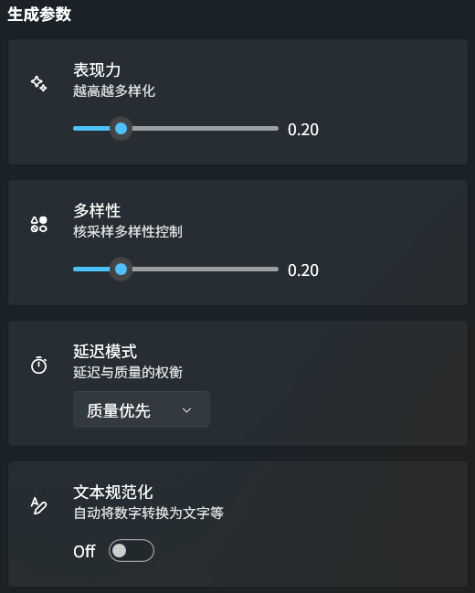

<div align="center">
  <a href="https://github.com/Cirnouo/STranslate.Plugin.Tts.FishAudio">
    
  </a>

  <h1>Fish Audio TTS</h1>

  <p>
    <a href="https://fish.audio">Fish Audio</a> Text-to-Speech plugin for <a href="https://github.com/ZGGSONG/STranslate">STranslate</a>
  </p>

  <p>
    
    
    
    
    
  </p>

  <p>
    <a href="../README.md">简体中文</a> | <a href="README_TW.md">繁體中文</a> | <b>English</b> | <a href="README_JA.md">日本語</a> | <a href="README_KO.md">한국어</a>
  </p>
</div>

---

<div align="center">
  
</div>

## Features

- **High-quality synthesis** — Powered by Fish Audio S2-Pro / S1 engines, supporting 80+ languages
- **Model search** — Search, browse, preview and select voice models directly in the settings panel with pagination
- **Manual ID validation** — Enter a model ID manually and it auto-validates and loads the model info
- **Emotion markup** — Control speech emotion via inline text markers (S2-Pro: `[laugh]`, S1: `(happy)`)
- **Prosody control** — Speed (0.5x–2.0x), volume (±10 dB, 0.1 dB precision), loudness normalization
- **Generation parameters** — Expressiveness, diversity, latency mode (Quality / Balanced / Low Latency), text normalization
- **Account info** — Real-time credit balance and API latency indicator
- **Multilingual UI** — Simplified Chinese, Traditional Chinese, English, Japanese, Korean

## Installation

1. Go to the [Releases](https://github.com/Cirnouo/STranslate.Plugin.Tts.FishAudio/releases) page and download the latest `.spkg` file
2. In STranslate, go to **Settings → Plugins → Install Plugin**
3. Select the downloaded `.spkg` file and restart STranslate

> [!TIP]
> `.spkg` is essentially a ZIP file — STranslate extracts and loads it automatically.

## Prerequisites

- [STranslate](https://github.com/ZGGSONG/STranslate) (latest version)
- Fish Audio API Key ([get one here](https://fish.audio/app/api-keys))
- Fish Audio account balance > 0

> [!NOTE]
> To purchase/top-up API credits: [Console > Developer > Billing > Balance > Purchase Credits](https://fish.audio/app/developers/billing/). Credit deduction may be delayed — refreshing immediately after playback may briefly show stale values.

## Configuration

<details>
<summary><b>Parameter Reference</b> (click to expand)</summary>

| Parameter | Default | Description |
| :-- | :--: | :-- |
| API Key | — | Fish Audio API key (required) |
| Model ID | — (Random Model) | Voice model ID; search to select or enter manually. When empty, a random model (system default voice) is used |
| Engine | `s2-pro` | `s2-pro` (recommended) or `s1` |
| Speed | `1.0` | 0.5–2.0 |
| Volume | `0 dB` | -10 to +10 dB, 0.1 dB precision |
| Loudness Normalization | On | Shown only when using S2-Pro engine |
| Expressiveness | `0.7` | 0–1, higher = more varied |
| Diversity | `0.7` | 0–1 |
| Latency Mode | Quality | Quality / Balanced / Low Latency |
| Text Normalization | Off | Auto-convert numbers to words, etc. |

</details>

### Screenshots

<details>
<summary><b>UI Screenshots</b> (click to expand)</summary>

#### Account & API



#### Model Selection & Search

<div>
    
</div>

<div>
    
</div>

### TTS Engine



#### Prosody Control



#### Generation Parameters



</details>

## Emotion Markup

Fish Audio controls emotion through inline text markers — no extra API parameters needed:

**S2-Pro** (recommended) — square brackets + natural language descriptions, placed anywhere in text:
```
[angry] This is unacceptable!
I can't believe [gasp] you actually did it [laugh]
[whisper] This is a secret
```

**S1** — parentheses + fixed tag set, placed at the beginning of a sentence:
```
(happy) What a beautiful day!
(sad)(whispering) I miss you so much.
```

## Build

```powershell
# Standard build (Debug + .spkg packaging)
.\build.ps1

# Clean build
.\build.ps1 -Clean

# Release build
.\build.ps1 -Configuration Release
```

Build output goes to the repository root as `STranslate.Plugin.Tts.FishAudio.spkg`.

<details>
<summary><b>Requirements</b></summary>

- .NET 10.0 SDK
- Windows (WPF project)

</details>

## Acknowledgements

- [STranslate](https://github.com/ZGGSONG/STranslate) — A ready-to-use translation and OCR tool
- [Fish Audio](https://fish.audio) — Text-to-speech API provider
- [iNKORE WPF Modern UI](https://github.com/iNKORE-NET/UI.WPF.Modern) — Modern UI control library for WPF

## License

[MIT](../LICENSE)
