<div align="center">
  <a href="https://github.com/Cirnouo/STranslate.Plugin.Tts.FishAudio">
    
  </a>

  <h1>Fish Audio TTS</h1>

  <p>
    <a href="https://fish.audio">Fish Audio</a> 音声合成プラグイン for <a href="https://github.com/ZGGSONG/STranslate">STranslate</a>
  </p>

  <p>
    
    
    
    
    
  </p>

  <p>
    <a href="../README.md">简体中文</a> | <a href="README_TW.md">繁體中文</a> | <a href="README_EN.md">English</a> | <b>日本語</b> | <a href="README_KO.md">한국어</a>
  </p>
</div>

---

<div align="center">
  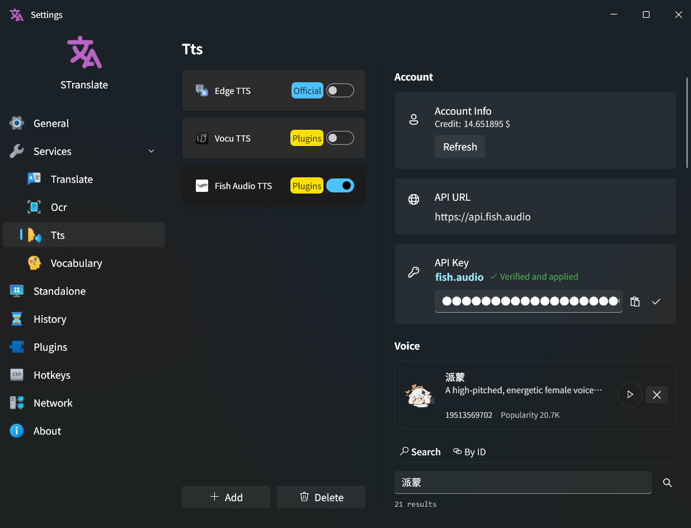
</div>


## 機能概要

- **高品質合成**: Fish Audio S2-Pro / S1 合成モデルに対応し、80 以上の言語をカバーします。
- **ボイス選択**: 名前で検索することも、ボイス ID を直接入力することもできます。試聴、選択、クリア、ページ送りに対応します。
- **カバーキャッシュ**: ボイスの `cover_image` を自動キャッシュして再読み込みを減らします。設定画面で使用量を確認し、削除できます。
- **アカウント確認**: API Key 検証後に残高と「検証済み・適用済み」状態を表示し、設定が有効になったことを確認できます。
- **合成制御**: 速度、音量、ラウドネス正規化、MP3 ビットレート、表現力、多様性、レイテンシモード、テキスト正規化、コンテキスト連携を設定できます。
- **感情マーカー**: S2-Pro の `[laugh]` や S1 の `(happy)` など、Fish Audio の感情マーカーをテキストに追加できます。
- **多言語 UI**: 簡体字中国語、繁体字中国語、English、日本語、한국어。

## クイックスタート

### 1. プラグインをインストール

STranslate のプラグインマーケットからインストールする方法を推奨します。マーケットを利用できない場合は、GitHub Release から `.spkg` をダウンロードして手動インストールできます。

**方法 1: STranslate プラグインマーケット**

1. STranslate を開きます。
2. **設定 -> プラグイン -> マーケット** に移動します。
3. **Fish Audio TTS** を検索または探して、ダウンロードしてインストールします。
4. インストール後は STranslate の再起動を推奨します。

**方法 2: `.spkg` を手動インストール**

1. [Releases](https://github.com/Cirnouo/STranslate.Plugin.Tts.FishAudio/releases) ページを開きます。
2. 最新の `STranslate.Plugin.Tts.FishAudio.spkg` をダウンロードします。
3. STranslate で **設定 -> プラグイン -> プラグインのインストール** を開きます。
4. ダウンロードした `.spkg` ファイルを選択し、STranslate を再起動します。

> [!TIP]
> `.spkg` は本質的に ZIP ファイルです。STranslate が自動で展開して読み込むため、手動で解凍する必要はありません。

### 2. API Key を取得

1. [Fish Audio API Keys](https://fish.audio/app/api-keys) にログインします。
2. API Key を作成またはコピーします。

<!-- スクリーンショット: images/fish-audio-api-keys.png
     内容: Fish Audio API Keys ページ。API Key の作成/コピー位置を強調し、実際の API Key は隠してください。 -->
<div>
  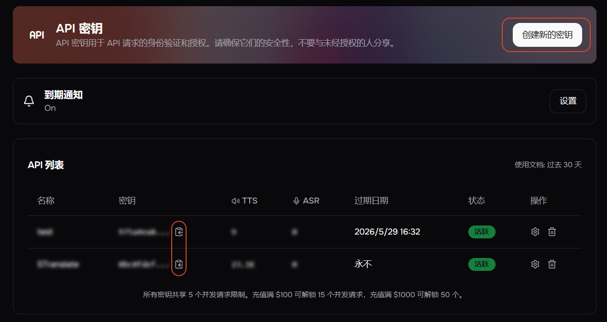
</div>

3. プラグイン設定ページの **API Key** 入力欄に貼り付けます。
4. 確認ボタンをクリックするか、入力欄にフォーカスした状態で `Enter` を押します。
5. **検証済み・適用済み** が表示され、アカウント情報に残高が表示されれば、現在の API Key がプラグインで使用されています。

<!-- スクリーンショット: images/settings-account-api.png
     内容: プラグイン設定ページのアカウント情報、API Key 入力欄、確認ボタン、検証済み・適用済み状態、残高。 -->
<div>
  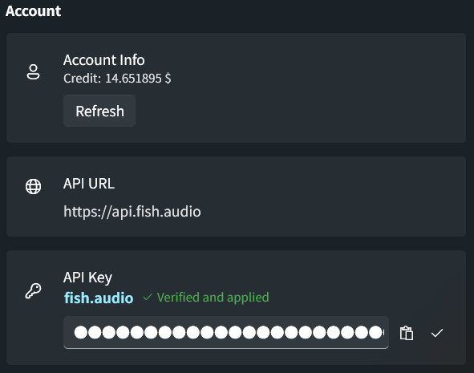
</div>

### 3. API クレジットを購入

Fish Audio TTS は Fish Audio API クレジットを消費します。[Console -> Developer -> Billing -> Balance -> Purchase Credits](https://fish.audio/app/developers/billing/) で購入またはチャージできます。

<!-- スクリーンショット: images/fish-audio-billing.png
     内容: Fish Audio Billing/Balance/Purchase Credits の入口。クレジット購入またはチャージ位置を強調してください。 -->
<div>
  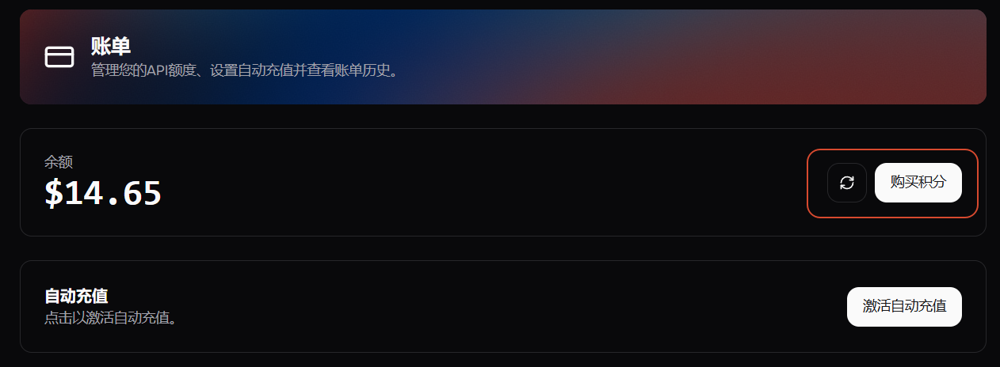
</div>

> [!NOTE]
> クレジットの差し引きには遅延が発生する場合があります。再生直後に残高を更新すると、しばらく古い残高が表示されることがあります。

> [!TIP]
> `.edu` メールアドレスで登録して学生認証を完了すると、Fish Audio の学生向けクレジットを受け取れます。入口: [Fish Audio Students](https://fish.audio/students/)。

### 4. ボイスを設定

ボイスは読み上げ時の音色を決定します。プラグインには **検索** と **ID 指定** の 2 つの設定方法があります。

> [!NOTE]
> ボイスを設定しなくてもプラグインは使用できます。この場合、プラグインは Fish Audio に `reference_id` を送信せず、Fish Audio がランダムボイスを使用します。ランダムボイスでも API クレジットは消費されます。

**方法 1: 名前で検索**

1. ボイスセクションの **検索** タブに切り替えます。
2. 入力欄にボイス名を入力します。
3. 検索アイコンをクリックするか、入力欄にフォーカスした状態で `Enter` を押します。
4. 結果からボイスを試聴し、決まったら **選択** をクリックします。
5. 結果が多い場合は、ページ送りコントロールでページを切り替えます。

<!-- スクリーンショット: images/settings-voice-search.png
     内容: 検索入力欄、検索ボタン、検索結果、試聴ボタン、選択ボタン、ページ送りを含むプラグインのボイス検索画面。 -->
<div>
  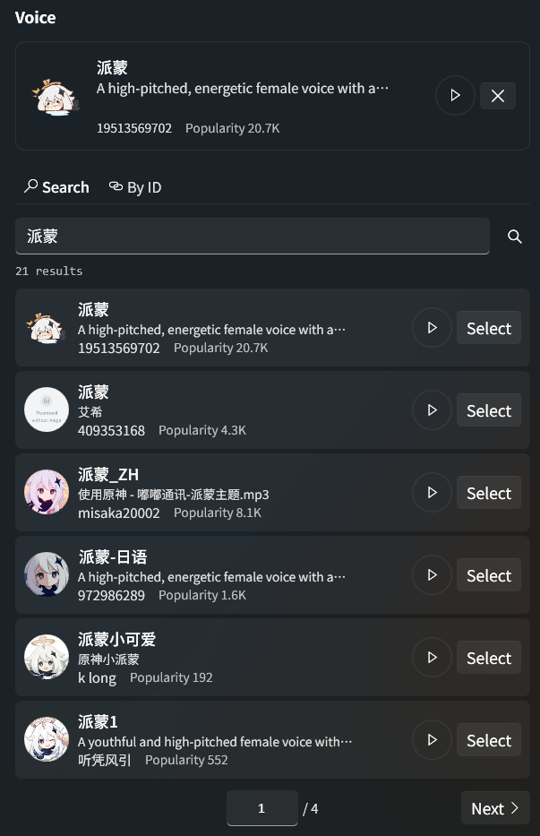
</div>

**方法 2: ボイス ID を使う**

1. Fish Audio 公式サイトで対象ボイスの詳細ページを開きます。
2. 展開メニューからボイス ID をコピーします。

<!-- スクリーンショット: images/fish-audio-voice-id.png
     内容: Fish Audio ボイス詳細ページ。ボイス ID の位置を強調し、個人アカウント情報は表示しないでください。 -->
<div>
  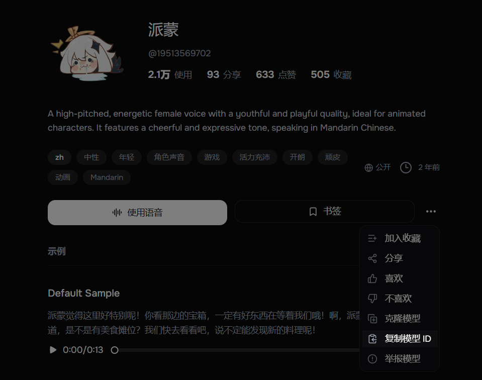
</div>

3. プラグイン設定ページに戻り、**ID 指定** タブに切り替えます。
4. ボイス ID を貼り付け、確認ボタンをクリックするか、入力欄にフォーカスした状態で `Enter` を押します。
5. プラグインが ID を検証し、ボイス情報を読み込みます。


<!-- スクリーンショット: images/settings-voice-by-id.png
     内容: ボイス ID 入力欄、貼り付けボタン、確認ボタンを含む ID 指定設定画面。 -->
<div>
  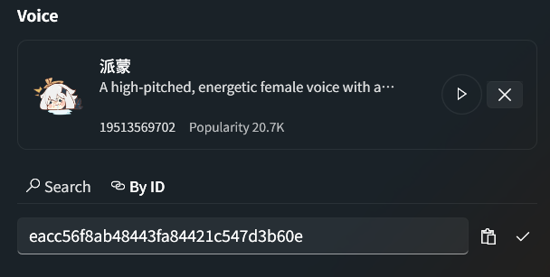
</div>

## 設定

プラグイン設定ページは、アカウント、ボイス、モデル、音声出力、韻律、生成パラメータ、その他の順に構成されています。

### アカウントと API

<!-- スクリーンショット: images/settings-account-api.png
     内容: アカウント情報、API URL、API Key 入力欄、検証状態、残高、更新ボタン。 -->
<div>
  
</div>

| 設定項目 | 説明 |
| :-- | :-- |
| アカウント情報 | 現在の API Key に対応する残高を米ドル単位で表示します。**更新** をクリックすると手動で残高を更新できます。 |
| API URL | Fish Audio API の URL です。現在は `https://api.fish.audio` に固定されています。 |
| API Key | Fish Audio API キーです。確認ボタンをクリックするか `Enter` を押した後にだけ検証され、適用されます。 |
| 検証状態 | サーバー応答待ちの間は **応答待ち** を表示します。成功後は **検証済み・適用済み** を表示し、形式エラーは入力欄の横に表示されます。 |

### ボイス

名前でボイスを検索

<!-- スクリーンショット: images/settings-voice-search.png
     内容: 選択済みボイス表示エリア + 検索タブ。カバー、タイトル、作者、人気度、試聴、選択、クリア操作を表示。 -->
<div>
  
</div>

ID でボイスを取得

<!-- スクリーンショット: images/settings-voice-by-id.png
     内容: ID 指定タブの 1 行入力欄と操作ボタン。検索タブと初期高さが揃っている状態。 -->
<div>
  
</div>

| 設定項目 | 説明 |
| :-- | :-- |
| 選択済みボイス | 現在適用されているボイス情報を表示します。未設定の場合は **ランダムボイス** と表示されます。 |
| 検索 | Fish Audio のボイスを名前で検索し、試聴してから選択できます。検索結果のカバー画像は自動でキャッシュされます。 |
| ID 指定 | すでにボイス ID を知っている場合に適しています。ボイス ID は 32 桁の小文字 16 進文字列である必要があります。 |
| ボイスをクリア | 現在のボイス設定をクリアし、ランダムボイスに戻します。 |

### モデルと音声出力

<!-- スクリーンショット: images/settings-model-audio.png
     内容: 合成モデルと MP3 ビットレートの 2 つの設定カード。 -->
<div>
  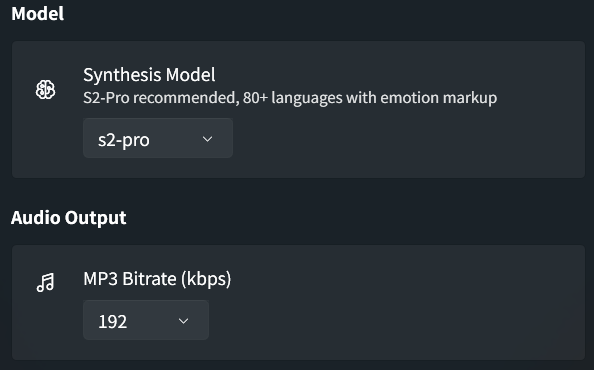
</div>

| 設定項目 | デフォルト | 説明 |
| :-- | :--: | :-- |
| 合成モデル | `s2-pro` | Fish Audio の合成エンジンを選択します。`s2-pro` は推奨オプションで、80 以上の言語とより豊富な感情マーカーに対応します。`s1` は旧モデルの挙動が必要な場合に使用できます。 |
| MP3 ビットレート | `192 kbps` | 出力音声の品質とサイズを制御します。`64`、`128`、`192` から選択できます。ビットレートが高いほど通常は音質が良く、ファイルも大きくなります。 |

### 韻律

<!-- スクリーンショット: images/settings-prosody.png
     内容: 速度、音量、ラウドネス正規化の 3 つの設定項目。 -->
<div>
  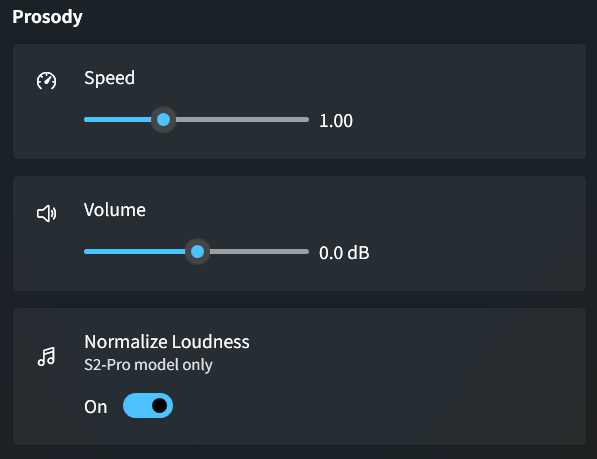
</div>

| 設定項目 | デフォルト | 説明 |
| :-- | :--: | :-- |
| 速度 | `1.0` | 読み上げ速度を制御します。範囲は `0.5` から `2.0` です。`1.0` より小さいと遅く、大きいと速くなります。 |
| 音量 | `0 dB` | 音量オフセットを制御します。範囲は `-10 dB` から `+10 dB` で、`0.1 dB` 精度に対応します。 |
| ラウドネス正規化 | オン | `s2-pro` モデルでのみ表示され、出力ラウドネスを安定させます。 |

### 生成パラメータ

<!-- スクリーンショット: images/settings-generation.png
     内容: 表現力、多様性、レイテンシモード、テキスト正規化、コンテキスト連携の設定項目。 -->
<div>
  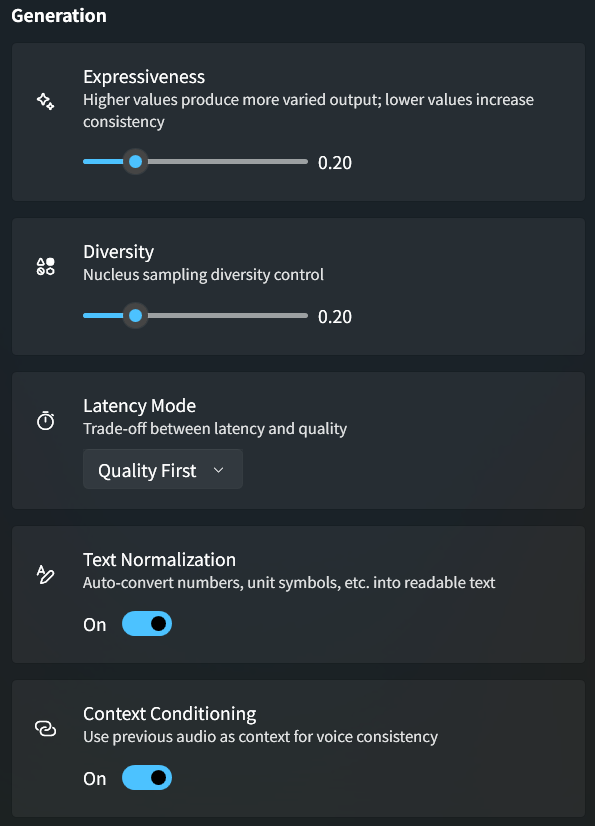
</div>

| 設定項目 | デフォルト | 説明 |
| :-- | :--: | :-- |
| 表現力 | `0.7` | 生成時のサンプリング温度に対応します。値が高いほど表現の変化が大きく、低いほど安定します。 |
| 多様性 | `0.7` | `top_p` に対応します。値が高いほどサンプリング範囲が広く、低いほど結果が収束します。 |
| レイテンシモード | 品質優先 | 品質と応答速度のバランスを選択します：品質優先、バランス、低レイテンシ。 |
| テキスト正規化 | オフ | 数字、単位記号などを読み上げに適したテキストへ自動変換します。 |
| コンテキスト連携 | オン | 前の音声をコンテキストとして使用し、長文でも声の一貫性を保ちやすくします。 |

### その他

<!-- スクリーンショット: images/settings-misc-cache.png
     内容: その他セクションのキャッシュ使用量、キャッシュ削除ボタン、処理中の待機表示。 -->
<div>
  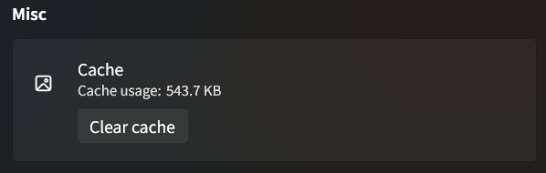
</div>

| 設定項目 | 説明 |
| :-- | :-- |
| キャッシュ使用量 | プラグインキャッシュディレクトリ内の実際の `cover_images/*.jpg` ファイルサイズをスキャンし、B、KB、MB、GB などの単位で自動表示します。 |
| キャッシュをクリア | ボイスのカバー画像キャッシュを削除します。削除中はボタンが無効化され、回転する待機表示が出ます。完了またはタイムアウト後に再びクリック可能になります。 |

<details>
<summary><b>パラメータ一覧</b>（クリックで展開）</summary>

| パラメータ | デフォルト | 説明 |
| :-- | :--: | :-- |
| API Key | - | Fish Audio API キー。必須です。 |
| ボイス ID | -（ランダムボイス） | 検索で選択、または手動入力できます。空の場合はランダムボイスを使用します。 |
| 合成モデル | `s2-pro` | `s2-pro` または `s1`。 |
| MP3 ビットレート | `192 kbps` | `64`、`128`、`192` から選択できます。 |
| 速度 | `1.0` | 範囲は `0.5` から `2.0`。 |
| 音量 | `0 dB` | 範囲は `-10 dB` から `+10 dB`。 |
| ラウドネス正規化 | オン | `s2-pro` モデルでのみ表示されます。 |
| 表現力 | `0.7` | 範囲は `0` から `1`。 |
| 多様性 | `0.7` | 範囲は `0` から `1`。 |
| レイテンシモード | 品質優先 | 品質優先 / バランス / 低レイテンシ。 |
| テキスト正規化 | オフ | 数字、単位記号などを読み上げに適したテキストへ変換します。 |
| コンテキスト連携 | オン | 前の音声をコンテキストとして使用し、声の一貫性を保ちます。 |

</details>

## 感情マーカー

Fish Audio はテキスト内のインラインマーカーで感情を制御します。追加の API パラメータは不要です。

**S2-Pro**（推奨）は角括弧と自然言語の説明を使用し、テキストの任意の位置に配置できます：

```text
[angry] これは許せない！
信じられない [gasp] 本当にやったんだ [laugh]
[whisper] これは秘密だよ
```

**S1** は丸括弧と固定タグセットを使用し、通常は文頭に配置します：

```text
(happy) 今日はいい天気ですね！
(sad)(whispering) あなたがとても恋しいです。
```

## よくある質問

**ボイスを設定しないと課金されますか？**

はい。ボイス未設定時は Fish Audio がランダムボイスで音声を生成し、API クレジットは消費されます。

**試聴は課金されますか？**

いいえ。プラグインの試聴は Fish Audio のボイス項目に含まれる公開サンプル音声を再生するだけで、TTS 合成エンドポイントは呼び出しません。そのため、API Key が未検証でも試聴できます。実際に STranslate でプラグインを使ってテキストを合成読み上げする場合のみ、有効な API Key が必要で、クレジットを消費します。

**再生後すぐに残高が変わらないのはなぜですか？**

Fish Audio のクレジット差し引きには遅延が発生する場合があります。再生直後に残高を更新すると、しばらく古い残高が表示されることがあります。

**ボイス検索の前に API Key を設定する必要がありますか？**

ボイス検索、ID 指定検索、試聴は API Key 未検証でも使用できます。ただし、実際の音声合成には有効な API Key と利用可能なクレジットが必要です。

**キャッシュをクリアすると選択済みボイスに影響しますか？**

いいえ。キャッシュ削除はボイスのカバー画像キャッシュだけを削除します。ボイス ID と選択済みボイス情報は保持されます。後で再表示されると、カバー画像は再度読み込まれます。

## ビルド

```powershell
# 標準ビルド（Debug + .spkg パッケージング）
.\build.ps1

# クリーンビルド
.\build.ps1 -Clean

# クリーンビルドして回帰テストを実行
.\build.ps1 -Clean -Test

# Release ビルド
.\build.ps1 -Configuration Release
```

ビルド成果物はリポジトリルートに `STranslate.Plugin.Tts.FishAudio.spkg` として出力されます。

<details>
<summary><b>環境要件</b></summary>

- .NET 10.0 SDK
- Windows（WPF プロジェクト）

</details>

## 謝辞

- [STranslate](https://github.com/ZGGSONG/STranslate) — すぐに使える翻訳・OCR ツール
- [Fish Audio](https://fish.audio) — 音声合成 API プロバイダー
- [iNKORE WPF Modern UI](https://github.com/iNKORE-NET/UI.WPF.Modern) — WPF モダン UI コントロールライブラリ

## ライセンス

[MIT](../LICENSE)
