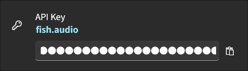
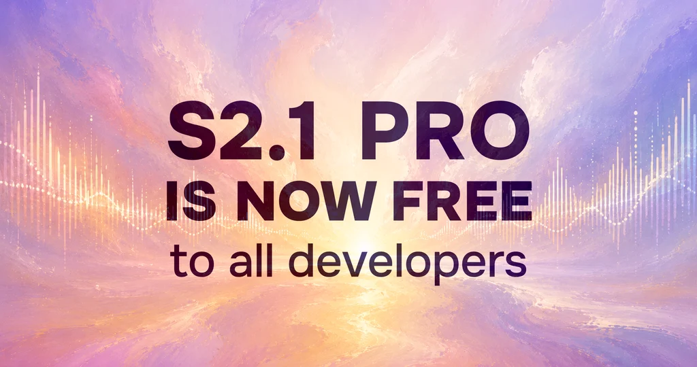
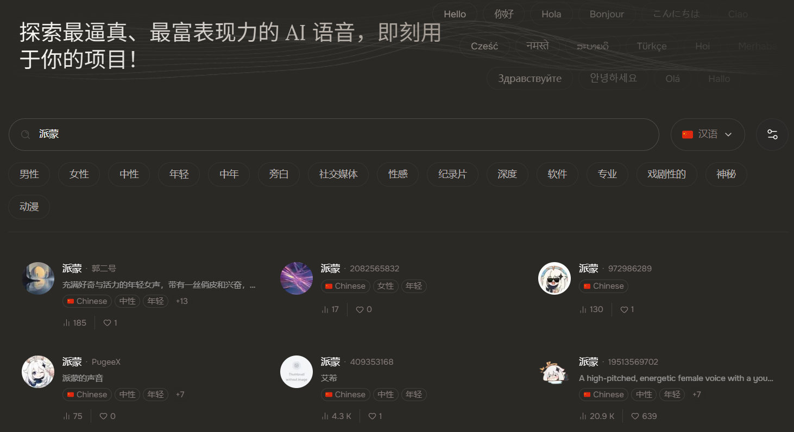
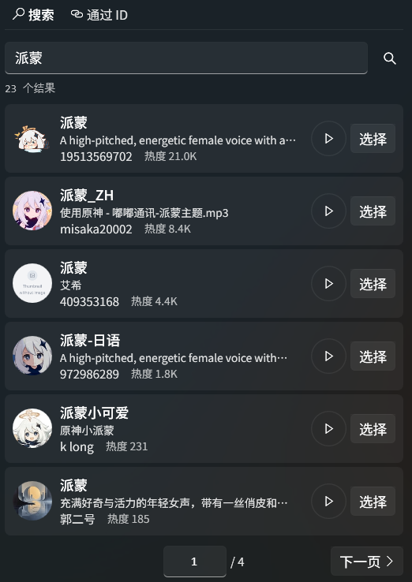
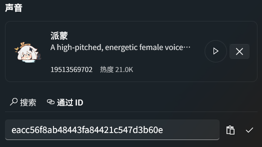

<div align="center">
  <a href="https://github.com/Cirnouo/STranslate.Plugin.Tts.FishAudio">
    
  </a>

  <h1>Fish Audio TTS</h1>

  <p>
    <a href="https://fish.audio">Fish Audio</a> 음성 합성 플러그인 for <a href="https://github.com/ZGGSONG/STranslate">STranslate</a>
  </p>

  <p>
    
    
    
    
    
  </p>

  <p>
    <a href="../README.md">简体中文</a> | <a href="README_TW.md">繁體中文</a> | <a href="README_EN.md">English</a> | <a href="README_JA.md">日本語</a> | <b>한국어</b>
  </p>
</div>

---

<div align="center">
  
</div>

## 1 기능 개요

- **고품질 합성**: Fish Audio s2.1-pro-free / s2.1-pro / s2-pro / s1 합성 모델을 지원하며 80개 이상의 언어를 다룹니다
- **보이스 선택**: 이름으로 검색하거나 보이스 ID를 직접 입력할 수 있으며, 미리듣기, 선택, 지우기, 페이지 탐색을 지원합니다
- **합성 제어**: 속도, 음량, 라우드니스 정규화, MP3 비트레이트, 표현력, 다양성, 지연 모드, 텍스트 정규화, 컨텍스트 연결을 지원합니다
- **감정 마커**: S2-Pro의 `[laugh]` 또는 S1의 `(happy)` 같은 Fish Audio 감정 마커를 텍스트에 추가할 수 있습니다
- **보이스 커뮤니티**: Fish Audio 크리에이터 커뮤니티의 공개 보이스를 둘러보고, 플러그인 안의 검색, 미리듣기, ID 설정으로 원하는 음색을 빠르게 적용할 수 있습니다
- **현지화**: 简体中文, 繁體中文, English, 日本語, 한국어

## 2 빠른 시작

### 2.1 설치

STranslate 플러그인 마켓에서 설치하는 방법을 우선 권장합니다

**STranslate 플러그인 마켓**

1. STranslate를 엽니다
2. **설정 -> 플러그인 -> 마켓**으로 이동합니다
3. **Fish Audio TTS**를 검색하거나 찾아서 다운로드 및 설치합니다

**수동 설치**

1. [Releases](https://github.com/Cirnouo/STranslate.Plugin.Tts.FishAudio/releases) 페이지를 엽니다
2. 최신 `STranslate.Plugin.Tts.FishAudio.spkg`를 다운로드합니다
3. STranslate에서 **설정 -> 플러그인 -> 설치**를 엽니다
4. 다운로드한 `.spkg` 파일을 선택합니다

### 2.2 API Key 받기 및 설정

> [!TIP]
> `.edu` 이메일로 Fish Audio에 가입하고 학생 인증을 완료하면 5달러 상당의 크레딧을 받을 수 있습니다. 입구: [Fish Audio Students](https://fish.audio/students/).

이메일로 가입하고 Fish Audio에 로그인한 뒤 [개발자 > API Keys](https://fish.audio/app/api-keys) 페이지에서 **Create new key**를 클릭하고 키를 복사합니다

<!-- 스크린샷: images/fish-audio-api-keys.png
     내용: Fish Audio API Keys 페이지. API Key 생성/복사 위치를 강조하고 실제 API Key는 가리세요. -->
<div>
  
</div>

플러그인 설정 페이지의 **API Key** 입력란에 붙여넣습니다

<div>
  
</div>

### 2.3 API 크레딧 구매

<div align="center">
  
</div>

S2.1 Pro 모델은 `2026-07-24`까지 기간 한정으로 무료입니다. 플러그인에서 `s2.1-pro-free` 모델을 선택해 사용합니다. 자세한 내용: [Fish Audio S2.1 Pro: Free Text-to-Speech API for Developers](https://fish.audio/blog/s2-1-pro-free-api/)

Fish Audio TTS는 Fish Audio API 잔액을 사용합니다. [콘솔 > 개발자 > 청구 > 잔액 > 크레딧 구매](https://fish.audio/app/developers/billing/) 페이지에서 구매할 수 있습니다

<!-- 스크린샷: images/fish-audio-billing.png
     내용: Fish Audio Billing/Balance/Purchase Credits 입구. 잔액 구매 또는 충전 위치를 강조하세요. -->
<div>
  
</div>

### 2.4 보이스 받기

보이스는 최종 읽기 음색을 결정합니다.

Fish Audio 보이스 커뮤니티에는 크리에이터가 공개한 보이스가 모여 있습니다. 공식 사이트에서 이름, 캐릭터, 언어별로 둘러보고 미리듣기한 뒤, 플러그인으로 돌아와 같은 이름의 보이스를 검색하거나 보이스 ID를 복사해 바로 적용할 수 있습니다. 입구: [Creative > Discover](https://fish.audio/app/discovery)

<div>
  
</div>

### 2.5 보이스 설정

플러그인은 **이름으로 보이스 검색**과 **ID로 직접 설정** 두 가지 방법을 제공합니다

> [!NOTE]
> 보이스를 설정하지 않으면 기본적으로 무작위 보이스를 사용합니다. 무작위 보이스도 API 잔액을 소모합니다

#### 2.5.1 이름으로 보이스 검색

플러그인의 **검색** 탭에 보이스 이름을 입력하고 검색 아이콘을 클릭하거나 `Enter`를 누릅니다. 결과 목록은 미리듣기와 페이지 탐색을 지원하며, **선택**을 클릭하면 해당 보이스가 적용됩니다.

<div>
  
</div>

#### 2.5.2 ID로 직접 설정

보이스 커뮤니티에서 대상 보이스 상세 페이지를 열고 페이지 작업 영역의 더보기 메뉴(`...`)를 클릭한 뒤 `모델 ID 복사`를 선택합니다. Fish Audio의 현재 메뉴명은 아직 "모델 ID"이지만, 복사되는 값이 플러그인에 필요한 보이스 ID입니다.

<!-- 스크린샷: images/fish-audio-voice-id.png
     내용: Fish Audio 보이스 상세 페이지. 보이스 ID 위치를 강조하고 개인 계정 정보는 노출하지 마세요. -->
<div>
  
</div>

플러그인의 **ID 지정** 탭으로 돌아가 ID를 붙여넣고 확인 버튼을 클릭합니다. 플러그인이 보이스 정보를 로드하고 해당 보이스를 적용합니다.

<div>
  
</div>

## 3 설정

<details>
<summary><b>매개변수 목록</b> (클릭하여 펼치기)</summary>

| 매개변수 | 기본값 | 설명 |
| :-- | :--: | :-- |
| API Key | - | Fish Audio API 키, 필수입니다. |
| 보이스 ID | 무작위 보이스 | 검색으로 선택하거나 직접 입력할 수 있습니다. 비어 있으면 무작위 보이스를 사용합니다. |
| 합성 모델 | 무료 기간에는 `s2.1-pro-free`, 이후에는 `s2.1-pro` | 2026-07-24 UTC 전에는 `s2.1-pro-free`, `s2.1-pro`, `s2-pro`, `s1` 선택 가능. 이후 무료 모델은 숨겨집니다. |
| MP3 비트레이트 | `192 kbps` | `64`, `128`, `192`를 선택할 수 있습니다. |
| 속도 | `1.0` | 범위 `0.5`부터 `2.0`까지. |
| 음량 | `0 dB` | 범위 `-10 dB`부터 `+10 dB`까지. |
| 라우드니스 정규화 | 켜짐 | `s2.1-pro-free`, `s2.1-pro`, `s2-pro`에서 사용할 수 있으며 `s1`에서는 비활성화되어 표시됩니다. |
| 표현력 | `0.7` | 범위 `0`부터 `1`까지. |
| 다양성 | `0.7` | 범위 `0`부터 `1`까지. |
| 지연 모드 | 품질 우선 | 품질 우선 / 균형 / 저지연. |
| 텍스트 정규화 | 꺼짐 | 숫자, 단위 기호 등을 읽기에 더 적합한 텍스트로 자동 변환합니다. |
| 컨텍스트 연결 | 켜짐 | 같은 합성 오디오 안의 앞선 조각만 컨텍스트로 사용하며, 이전에 생성한 다른 오디오는 참조하지 않습니다. |

</details>

## 4 고급 사용법

### 4.1 감정 제어

Fish Audio는 텍스트 안의 인라인 마커로 감정을 제어하며, 추가 API 파라미터는 필요하지 않습니다. 합성할 텍스트에 마커를 직접 작성하면 됩니다. 문장의 감정, 말투의 강도, 웃음, 놀람, 속삭임 같은 음성 효과를 지정할 때 사용할 수 있습니다.

**S2 계열 모델**(권장)은 대괄호와 자연어 설명을 사용합니다. 문장 전체 감정은 보통 문장 앞에 두고, 말투나 효과음 마커는 적용하고 싶은 위치에 둘 수 있습니다:

```text
[angry] 이건 받아들일 수 없어!
믿기지 않아 [gasp] 네가 정말 해냈다 [laugh]
[whisper] 이건 비밀이야
```

**S1**은 소괄호와 고정 태그 집합을 사용하며, 보통 문장 앞에 둡니다

```text
(happy) 오늘 날씨가 정말 좋다!
(sad)(whispering) 너무 보고 싶어
```

가능하면 문장마다 하나의 주요 감정만 사용하고, 짧은 텍스트에 너무 많은 마커를 겹쳐 넣지 않는 것이 좋습니다. 전체 태그 목록, 조합 방식, 문제 해결 팁은 공식 문서를 참고하세요: [Emotion Control](https://docs.fish.audio/developer-guide/core-features/emotions).

### 4.2 세밀한 제어

세밀한 제어는 단어, 글자, 짧은 구문의 정확한 발음을 지정할 때 사용합니다. 인명, 브랜드명, 중국어 다성자, 전문 용어, 일본어 피치 악센트를 정확히 제어해야 하는 경우에 적합합니다. 대상 발음을 `<|phoneme_start|>`와 `<|phoneme_end|>`로 감싸고, 일반 문장 부호와 주변 텍스트는 태그 밖에 둡니다.

영어는 CMU Arpabet을 사용하며, 보통 한 단어를 대체합니다:

```text
I am an <|phoneme_start|>EH1 N JH AH0 N IH1 R<|phoneme_end|>.
```

중국어는 성조 숫자가 붙은 병음을 사용하며, 한 음절마다 하나의 태그를 사용합니다:

```text
我是一个<|phoneme_start|>gong1<|phoneme_end|><|phoneme_start|>cheng2<|phoneme_end|><|phoneme_start|>shi1<|phoneme_end|>。
```

일본어는 OpenJTalk 스타일의 로마자 음소와 피치 숫자를 사용하며, 보통 짧은 구문을 감쌉니다:

```text
<|phoneme_start|>ha0shi1ga0<|phoneme_end|>見えます。
```

전체 형식, 기호표, 생성 도구를 자세히 보려면 공식 문서를 참고하세요: [Fine-grained Control](https://docs.fish.audio/developer-guide/core-features/fine-grained-control), [English Phoneme Control](https://docs.fish.audio/developer-guide/core-features/fine-grained-control/english), [Chinese Phoneme Control](https://docs.fish.audio/developer-guide/core-features/fine-grained-control/chinese), [Japanese Phoneme Control](https://docs.fish.audio/developer-guide/core-features/fine-grained-control/japanese).

## 자주 묻는 질문

**Q: 보이스를 설정하지 않으면 요금이 청구되나요?**

A: 네. 보이스를 설정하지 않으면 Fish Audio가 무작위 보이스로 음성을 생성하며, 이 경우에도 API 잔액이 소모됩니다

**Q: 미리듣기도 과금되나요?**

A: 아니요. 플러그인의 미리듣기는 보이스에 포함된 공개 오디오를 재생할 뿐이며 TTS API를 호출하지 않습니다. 따라서 API Key를 설정하지 않아도 미리듣기를 사용할 수 있습니다

**Q: 재생 후 잔액이 바로 바뀌지 않는 이유는 무엇인가요?**

A: Fish Audio의 잔액 차감은 지연될 수 있습니다. 재생 직후 잔액을 새로고침하면 잠시 이전 잔액이 보일 수 있습니다

**Q: 보이스 검색 전에 API Key를 먼저 설정해야 하나요?**

A: 보이스 검색, ID로 조회, 미리듣기는 모두 API Key 설정 없이 사용할 수 있습니다. 하지만 실제 음성 합성에는 형식이 올바르고 사용 가능한 API Key와 잔액이 필요합니다

**Q: 캐시를 정리하면 선택한 보이스에 영향이 있나요?**

A: 아니요. 캐시 정리는 보이스 커버 이미지 캐시만 삭제합니다. 보이스 ID와 선택된 보이스 정보는 그대로 유지되며, 다음 표시 때 다시 로드됩니다

## 빌드

```powershell
# 표준 빌드 (Debug + .spkg 패키징)
.\build.ps1

# 정리 후 빌드
.\build.ps1 -Clean

# 정리 후 빌드 및 회귀 테스트 실행
.\build.ps1 -Clean -Test

# Release 빌드
.\build.ps1 -Configuration Release
```

빌드 산출물은 저장소 루트의 `STranslate.Plugin.Tts.FishAudio.spkg`로 출력됩니다

<details>
<summary><b>환경 요구 사항</b></summary>

- .NET 10.0 SDK
- Windows (WPF 프로젝트)

</details>

## 감사의 말

- [STranslate](https://github.com/ZGGSONG/STranslate) - 바로 사용할 수 있는 번역 및 OCR 도구
- [Fish Audio](https://fish.audio) - 음성 합성 API 제공자
- [iNKORE WPF Modern UI](https://github.com/iNKORE-NET/UI.WPF.Modern) - WPF용 모던 UI 컨트롤 라이브러리

## 라이선스

[MIT](../LICENSE)
